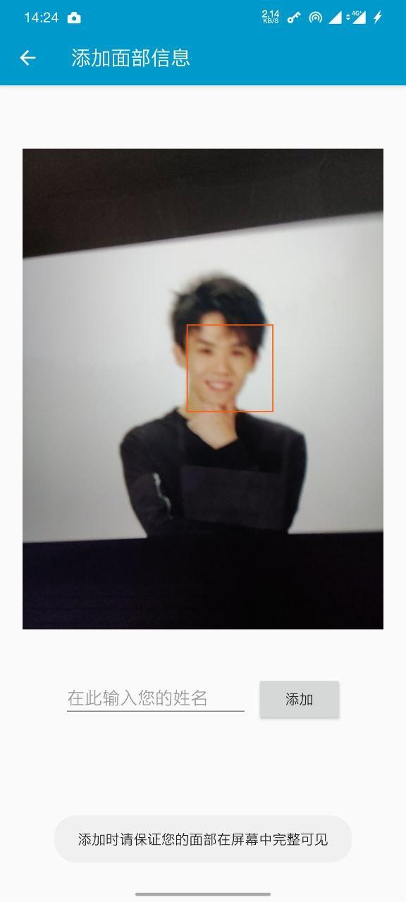

# faceDemo

## Features

- Used [CameraX](https://developer.android.com/training/camerax) to implement the preview and get images for analysis.
  
- Used ncnn2mem tool to convert the model files to header files, making the models hardcoded. Thus the demo can work once installed.

- Support simultaneous multi-face recognition.

## References

[ncnn](https://github.com/Tencent/ncnn)  

[mtcnn_ncnn](https://github.com/moli232777144/mtcnn_ncnn)  

[mobilefacenet-V2](https://github.com/qidiso/mobilefacenet-V2)  

[mobilefacenet-ncnn](https://github.com/liguiyuan/mobilefacenet-ncnn)

The CameraX provides image analysis use case, which produces images in YUV_420_888 format. The code [here](https://stackoverflow.com/questions/36212904/yuv-420-888-interpretation-on-samsung-galaxy-s7-camera2) can convert the images to Bitmap format.

## Screenshots

